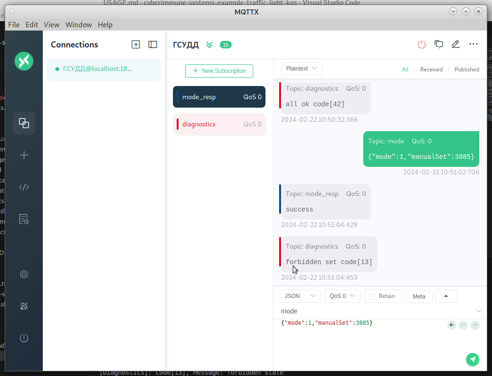

# ГСУДД через MQTT

В качестве протокола городской системы управления дорожным движением используется MQTT.
За основу взяты примеры mqtt_publisher mqtt_subscriber.

Роли "подписчик" и "публикатор" объединены в сущности Communication.

## Сущность Communication.

1. Принимает сообщения в теме "mode" в формате json (см. описание запросов ГСУДД)
2. Проверяет валидность запросов, на основании чего в теме "mode_resp" публикует сообщения "success" или "error"
3. Принимает код состояния от сущности Diagnostics и публикует трактовку в теме "diagnostics"

### Описание запросов ГСУДД

Запрос представляет собой json со следующими полями:
1. "mode" - режим работы, тип - целое:
   1- ручной режим, требует наличия поля "manualSet", запрещено поле "times"
   2- автоматический режим, запрещено поле "manualSet", опционально поле "times"
   3 - нерегулируемый (мигающий желтый во всех направлениях), дополнительные поля запрещены.
2. "manualSet" - целое, значение трактуется как Bitfield как указано в интерфейсе LightsGPIO
3. "times" - массив целых размера 8, установки времени нахождения в каждом состоянии машины состояний сущности ControlSystem

## Сущность ControlSystem

Принимает управляющие посылки в виде структуры от Communication, передаёт Bitfield включения сигналов в LightsGPIO.

В автоматическом режиме действует по шаблону "машина состояний". Всего 8 состояний:
1. Ручной режим, в LightsGPIO передается Bitfield полученный от ГСУДД
2. Нерегулируемый перекрёсток, мигающие желтые
3. Зеленый в направлении 1
4. Переход к зеленому в направлении 2, шаг 1, текущие цвета мигают
5. Переход к зеленому в направлении 2, шаг 2, оба направления - желтый цвет
6. Зеленый в направлении 2
7. Переход к зеленому в направлении 1, шаг 1, текущие цвета мигают
8. Переход к зеленому в направлении 1, шаг 2, оба направления - желтый цвет

Для каждого состояния задается время пребывания в нем в массиве 8 целых.
Для состояний задана таблица переходов:
1->2->7->8->3->4->5->6->7

Если время установлена в значение 0xFFFF - считается что этот режим специально установлен постоянно. Испльзуется для входа в режим ручного управления. Или для установки нерегулируемого режима.

Если сущность Communication в команде управления передает массив времен со всеми 0 - установка времён не производится (пользовватель не указал новый набор времён).

## Подготовка системы

1. поставить брокер mqtt

sudo apt install mosquitto

2. проверить запустился ли?

sudo systemctl status mosquitto

если нет, попробовать запустить вручную

sudo systemctl enable mosquitto
sudo systemctl start mosquitto

если опять нет, смотреть ошибки, например так

journalctl -u mosquitto

Если да, то работаем.

## Использование MQTTX в качестве имитации ГСУДД

Т.к. требуется одновременно как публиковать в темах так и слушать темы удобно воспользоваться более мощным инструментом чем консольные утилиты. В качестве такого предлагается MQTTX https://mqttx.app/

Инструмент поставляется в контейнере AppImage и не требует установки.

### Настройка

1. Запустить
2. Создать соединеие localhost (port=1883)
3. Подписаться на тему "mode_resp"
4. Подписаться на тему "diagnostics"
5. Отправлять сообщения в тему "mode"

Приеры сообщений
{"mode":1,"manualSet":3885} - ручной режим, включить все цвета и генератор мигания во всех направлениях, от диагностики должен прийти код 13 forbidden state"
{"mode":1,"manualSet":2570}  ручной режим, мигающий желтый, имитация состояния нерегулируемого перекрёстка.
{"mode":2} - перейти в автоматическое управление без перенастройки времени переключения
{"mode":3} - перейти в режим "нерегулируемый" (время нахождения будет установлено в 0xFFFF то есть "навсегда")

Пример сессии mqttx

